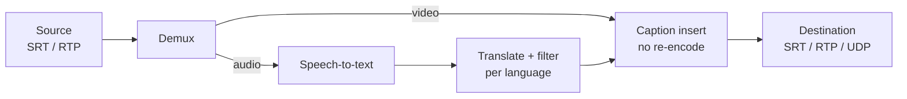
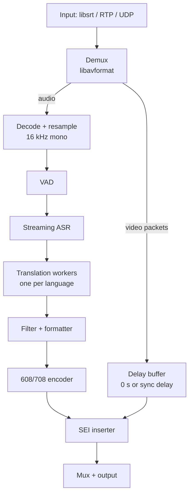

# MULTI — Product Requirements Document

**M**ultilingual **U**nified **L**ive **T**ranscription & **I**nsertion

Last updated: 2026-09-22

## Overview

MULTI is a self-hosted, open-source service that takes a live video stream in, generates closed captions from its audio in several languages at once, embeds them into the stream, and sends it back out, adding as little delay as possible.

**Problem.** Live captioning today means paying per hour for human stenographers or cloud APIs, sending audio off-site, and wiring several tools together. Small broadcasters, churches, schools, event streamers and municipal channels often go without captions, or with English only.

**Solution.** One binary that sits inline between a source (encoder, camera, playout) and a destination (CDN, decoder, restreamer). It ingests SRT or RTP, runs a small speech model on a local GPU or CPU, translates the text, filters it, and inserts standard caption tracks (CEA-608/708 and others) without re-encoding the video.

**Why local wins.** Once the hardware is paid for, MULTI costs nothing per hour of captioning. Cloud captioning bills every minute, per language, forever. That cost difference is the lead message in all positioning.

|  | MULTI (local) | Cloud captioning API | Human live captioner |
| --- | --- | --- | --- |
| Cost per extra hour | $0 (electricity only) | Billed per minute, per language | Billed per hour, usually one language |
| Extra languages | Free, limited by GPU | Each billed separately | A captioner per language |
| Audio leaves the building | Never | Always | Usually (remote captioner) |
| Works if internet drops | Yes (local outputs) | No | No, if remote |
| Latency control | Engineer tunes it | Fixed by vendor | Fixed by the person |
| Accuracy on names and jargon | Good with custom vocabulary | Good | Best |

Launch material should include a cost calculator: hours streamed per week × languages × a typical cloud rate, compared with a one-time GPU and a MULTI subscription.

Video takes the short path straight through; audio branches off to speech recognition, and the resulting caption text rejoins the video at insertion.

## Goals and non-goals

**Guiding principle: stability and reliability first, speed second.** When the two conflict, MULTI keeps the stream up and accepts later captions. Low latency still matters and has hard targets, but never at the cost of dropping video or crashing.

**Goals (v1.0)**

1. Caption a live stream in real time with speech-to-caption lag under 3 s (P95) on a mid-range GPU.
2. Produce at least 4 simultaneous caption languages from one source language.
3. Let the broadcast engineer tune every timing and quality trade-off (video delay, caption timing, model size, filtering) through configuration, with defaults that work out of the box.
4. Run fully local: no per-minute fees, no cloud account, no audio leaves the machine.
5. Filter profanity and user-listed words before captions are emitted, in every output language. Support swapping in different AI models, and output the common TV and web caption formats.
6. Ship for Linux x86-64 and Linux ARM64, with Windows x86-64 as a stretch goal.
7. Source code free to use, modify and build; official prebuilt binaries sold with support.

**Non-goals (v1.0)**

- Muting or bleeping the audio itself (captions only; audio filtering is a later feature).
- Dubbing or text-to-speech in other languages.
- Human-in-the-loop caption correction UI.
- Recording, VOD processing or file-based captioning (live only, though file input is useful for testing).
- Replacing a full broadcast playout or encoder: MULTI sits inline and does one job.
- FCC/Ofcom caption-quality certification (we aim to support compliance, not certify it).

## Target users and use cases

The primary buyer is a small technical team that runs live video without a caption budget and is comfortable with a command line or Docker.

| User | Use case | What they need most |
| --- | --- | --- |
| Houses of worship | Weekly services streamed to YouTube/Facebook, often with multilingual congregations | Several languages, low cost, simple setup |
| Schools and universities | Lectures, sports, graduations; accessibility obligations | Accuracy, reliability, on-prem privacy |
| Local government / PEG channels | Council meetings on cable and web | CEA-608/708 compliance, word filter, 24/7 uptime |
| Event and conference streamers | Multi-room events with international audiences | Many simultaneous languages, low latency |
| Small broadcasters and restreamers | Inline box between encoder and CDN | SRT in/out, stable latency, monitoring |
| Hobbyists and developers | Self-hosted streaming, integrations | Free source, ARM (Jetson, Raspberry Pi 5) support |

**Key user stories**

- As an operator, I point MULTI at an SRT source and destination, pick languages, and get a captioned stream in under 5 minutes.
- As a viewer, I choose English, Spanish or French captions in my player from the same stream.
- As a compliance owner, I can be confident no word on our blocklist ever appears in a caption.
- As an engineer, I can watch caption lag, GPU load and dropped frames in a dashboard and get alerted on failures.

## Functional requirements

P0 = required for v1.0, P1 = targeted for v1.0, P2 = later release.

**Ingest and output**

| ID | Requirement | Priority |
| --- | --- | --- |
| IO-1 | Ingest SRT (caller and listener modes, passphrase encryption) | P0 |
| IO-2 | Ingest RTP and MPEG-TS over UDP, unicast and multicast | P0 |
| IO-3 | Output SRT, RTP and UDP MPEG-TS to any IP:port; multiple outputs per input | P0 |
| IO-4 | Pass H.264 and HEVC video through without re-encoding | P0 |
| IO-5 | Ingest RTMP and output RTMP (for YouTube/Facebook/Twitch) | P1 |
| IO-6 | Accept file input for testing and benchmarks | P1 |
| IO-7 | Output HLS with WebVTT caption renditions | P2 |
| IO-8 | Survive source drop-outs: keep output alive, reconnect automatically | P0 |

**Transcription**

| ID | Requirement | Priority |
| --- | --- | --- |
| TR-1 | Streaming speech-to-text from the selected audio track and channel | P0 |
| TR-2 | Swappable speech model (see AI model backends); ship a default small model tuned for speed | P0 |
| TR-3 | Voice-activity detection so silence and music do not produce junk captions | P0 |
| TR-4 | Automatic source-language detection, with a manual override | P1 |
| TR-5 | Custom vocabulary / prompt (names, places, jargon) per stream | P1 |
| TR-6 | Speaker-change markers (">>" convention) | P2 |

**Translation**

| ID | Requirement | Priority |
| --- | --- | --- |
| TL-1 | Translate the transcript into N target languages in parallel | P0 |
| TL-2 | Each language is its own caption track (CC1–CC4 / 708 services / DVB) with a language tag | P0 |
| TL-3 | Source-language track is always available alongside translations | P0 |
| TL-4 | Swappable translation model, dedicated MT model or small LLM (see AI model backends) | P1 |

**AI model backends**

Models improve every few months, so MULTI treats them as plug-ins behind a stable interface rather than building around one model.

| ID | Requirement | Priority |
| --- | --- | --- |
| MD-1 | One backend interface for speech-to-text and one for translation; new models need no pipeline changes | P0 |
| MD-2 | At least two speech backends at v1.0: whisper.cpp (GGML/GGUF Whisper models) and ONNX Runtime (Parakeet, Moonshine and similar) | P0 |
| MD-3 | Translation backends: llama.cpp (GGUF small LLMs) and CTranslate2 (opus-mt, M2M-100) | P0 |
| MD-4 | Model registry file listing each model's backend, languages, licence, VRAM need, download URL and checksum | P0 |
| MD-5 | Choose a model per stream and per language (e.g. accurate model for the source, fast model for translations) | P1 |
| MD-6 | Load a custom or fine-tuned model from a local path | P1 |
| MD-7 | `multi bench` command: runs candidate models on a test clip and reports real-time factor, caption lag and VRAM on this machine | P1 |
| MD-8 | Optional remote backend over an OpenAI-compatible HTTP API, e.g. a local Ollama or vLLM server on another box. Off by default; never required | P2 |

**Caption formats and insertion**

MULTI supports the formats most TV and web delivery chains actually use. Each output picks its formats, and each language maps to a track or service within them.

| Format | Where it's used | Carried in | Priority |
| --- | --- | --- | --- |
| CEA-608 (line 21 data) | US/Canada TV; accepted by YouTube, Twitch and Facebook live ingest | H.264/HEVC SEI (ATSC A/53), CC1–CC4 | P0 |
| CEA-708 (DTVCC) | US digital TV (ATSC), cable, most IP broadcast chains | H.264/HEVC SEI, up to 6 standard services | P0 |
| WebVTT | HLS, browsers, most web players | Sidecar file / HLS subtitle rendition | P1 |
| SubRip (.srt) + live text feed | Archive, CMS upload, custom overlays | File and WebSocket/JSON per language | P1 |
| DVB Teletext subtitles | UK, Europe, Australia legacy chains | MPEG-TS Teletext PID | P1 |
| DVB Subtitles (EN 300 743) | Europe and other DVB countries | MPEG-TS, bitmaps rendered from text | P2 |
| IMSC1 / TTML (EBU-TT-D) | MPEG-DASH, CMAF and broadcaster OTT apps | Fragmented MP4 / sidecar | P2 |
| YouTube live caption HTTP ingest | YouTube streams where embedded 608 is not used | HTTP POST to YouTube | P2 |

CEA-608 only covers Latin-alphabet languages. Other scripts need 708, WebVTT, TTML or DVB.

| ID | Requirement | Priority |
| --- | --- | --- |
| CI-1 | Output any combination of the formats above on each output, with a language-to-track mapping | P0 |
| CI-2 | Roll-up, pop-on and paint-on caption modes; rows and line length configurable | P0 |
| CI-3 | Preserve any captions already in the source, or replace them (configurable) | P1 |

**Filtering**

| ID | Requirement | Priority |
| --- | --- | --- |
| FL-1 | User word blocklist, per language, whole-word and wildcard matching | P0 |
| FL-2 | Built-in explicit-language filter on by default, per language | P0 |
| FL-3 | Masking style: asterisks, first letter + asterisks, [bleep], or drop word | P0 |
| FL-4 | Filter runs after translation too, so no language leaks a blocked word | P0 |
| FL-5 | Allowlist to exempt words (e.g. place names that trip the filter) | P1 |
| FL-6 | Hot-reload lists without restarting the stream | P1 |

**Acceleration, control and monitoring**

| ID | Requirement | Priority |
| --- | --- | --- |
| OP-1 | NVIDIA CUDA acceleration; CPU fallback that still runs in real time at reduced accuracy | P0 |
| OP-2 | Apple/AMD/Intel acceleration (Vulkan, ROCm, OpenVINO) where the backend supports it | P2 |
| OP-3 | NVIDIA Jetson (ARM64 + CUDA) support | P1 |
| OP-4 | Config file (YAML/TOML) and CLI; every setting overridable by flag | P0 |
| OP-5 | Local web UI on a configurable address and port: stream status, live caption preview per language, lists editor | P1 |
| OP-6 | REST API and Prometheus metrics (caption lag, GPU %, drops, bitrate) | P1 |
| OP-7 | Multiple independent streams per instance, limited by hardware | P1 |
| OP-8 | Official Docker images, plus a systemd unit and Windows service | P1 |

## Configuration and tuning

Every timing and quality trade-off is a setting with a sensible default, so a broadcast engineer can tune MULTI for their own system instead of accepting our choices.

- Each setting lives in the config file and can be overridden by a CLI flag, the REST API or the web UI.
- Settings that are safe to change live (filters, caption offset, rows) reload without dropping the stream. The rest restart only the affected worker.
- Presets (`low-latency`, `balanced`, `accuracy`) set many values at once; `balanced` is the default. Anything set explicitly overrides the preset.
- `multi bench` suggests a preset and model for the detected hardware on first run.
- The UI shows measured caption lag next to the video delay, so the engineer can set one from the other.

| Setting | Default | Range / options | What it trades |
| --- | --- | --- | --- |
| `video.delay_ms` | 0 (pass-through) | 0–10,000 | Captions in sync vs a delayed stream |
| `captions.offset_ms` | 0 | −5,000 to +5,000 | Fine-tune caption timing against video |
| `captions.mode` | roll-up | roll-up, pop-on, paint-on | Fast and live vs cleaner reading |
| `captions.rows` | 3 | 1–4 | Screen coverage vs context |
| `captions.max_chars_per_line` | 32 | 20–42 (608 max 32) | Readability vs line breaks |
| `captions.clear_after_ms` | 4,000 | 1,000–30,000 | How long text lingers after speech stops |
| `asr.model` | chosen by `multi bench` | any registry model | Accuracy vs speed and VRAM |
| `asr.chunk_ms` | 500 | 200–3,000 | Lower lag vs accuracy |
| `asr.stability_passes` | 2 | 1–3 | Lower lag vs fewer on-screen corrections |
| `vad.threshold` | 0.5 | 0.1–0.9 | Catching quiet speech vs ignoring noise and music |
| `translate.segment` | clause | word, clause, sentence | Translation lag vs quality |
| `translate.max_wait_ms` | 800 | 200–3,000 | Upper limit on waiting for a clause to finish |
| `filter.profanity` | on | on, off, per language | — |
| `filter.mask_style` | first-letter | asterisks, first-letter, [bleep], drop | — |
| `audio.track` / `audio.channels` | first track, downmix | any track; any channel or pair | Which mic feed is transcribed |
| `srt.latency_ms` | 120 | 20–8,000 | Network resilience vs delay |
| `gpu.device` / `gpu.max_vram_mb` | auto / no limit | device index; MB | Sharing a GPU with an encoder |
| `web.bind` | 127.0.0.1 | any local address; 0.0.0.0 for all | Local-only safety vs remote access (token required when not localhost) |
| `web.port` | 8480 | 1–65535 | Avoiding clashes with other services; also serves the REST API and metrics |
| `degrade.max_lag_ms` | 5,000 | 1,000–30,000 | When to start shedding load to protect the stream |
| `degrade.order` | languages, model, source-only, pass-through | any order; per-language priority | Which captions to give up first under load |

## Non-functional requirements

Captions can only appear after the words are spoken, so how much to delay the video is the engineer's call. It is one setting, `video.delay_ms`.

- **0 ms (default, pass-through):** video goes out with under 250 ms added; captions trail speech by the caption lag below. This matches how live TV captioning already behaves.
- **Around the measured caption lag (e.g. 2,500 ms):** captions land on the right frames, at the cost of a delayed stream.
- **Anything in between**, plus `captions.offset_ms` for fine-tuning. The UI suggests a value from measured lag.

**Latency budget, speech to caption on screen, balanced preset (targets, to validate in the prototype)**

| Stage | Target (P95) |
| --- | --- |
| Audio buffering + VAD | 300 ms |
| Streaming speech-to-text (partial result) | 800 ms |
| Translation per language (parallel) | 500 ms |
| Filter + caption formatting | 50 ms |
| Insertion + 608/708 encoding rate limit | 500 ms |
| **Total, source language** | **~1.7 s (limit 2.5 s)** |
| **Total, translated language** | **~2.2 s (limit 3 s)** |

**Platforms**

| Platform | Tier | Acceleration |
| --- | --- | --- |
| Linux x86-64 (Ubuntu 22.04+/Debian 12+, glibc) | Tier 1 | NVIDIA CUDA, CPU |
| Linux ARM64 (Jetson Orin, Raspberry Pi 5, Ampere) | Tier 1 | CUDA on Jetson, CPU elsewhere |
| Windows 10/11 x86-64 | Tier 2 | NVIDIA CUDA, CPU |
| Windows ARM64 | Tier 3 (community) | CPU |
| macOS Apple Silicon | Tier 3 (community) | Metal, if backend supports it |

Tier 1 = built and tested on every release; Tier 2 = built every release, tested before major releases; Tier 3 = builds from source, best effort.

**Reliability (priority 1) and performance (priority 2)**

- **Video never stops because of captions.** A failure in any caption stage leaves video flowing untouched; the stream continues without captions, an alert fires, and the stage restarts within 5 s.
- **Crash isolation.** Speech and translation run as supervised worker processes, so a crash inside a C/C++ inference library cannot take down the video path.
- **Graceful degradation under load.** When caption lag passes a limit, MULTI sheds work in a configurable order: drop the lowest-priority languages, switch to a smaller model, go source-language only, and finally pass video through uncaptioned. It recovers automatically when load drops.
- **Soak testing.** 7-day run per milestone, 30-day run before each release: no unplanned restarts, memory growth under 5%.
- **Defensive code.** No panics on the video path (enforced by lint); every stream parser (MPEG-TS, SEI, SRT, RTP) is fuzzed in CI; a bad config reload is rejected and the running config kept.
- **Supervision.** Health endpoint and watchdog; systemd and Windows service units restart the process if it ever exits.
- Minimum reference hardware: one 1080p stream, 1 source + 3 translated languages on an 8 GB NVIDIA GPU (RTX 3060 class); one stream, source language only, on a Jetson Orin Nano.
- Accuracy target: word error rate within 3 points of the chosen model's published benchmark on our test set.

**Security and privacy**

- No telemetry by default; no network calls except configured streams and optional model download.
- Web UI and API bound to localhost by default, with token auth when exposed.

## Proposed architecture and technology

Decision: MULTI is written in **Rust**, as a single native binary that links the media libraries directly and runs speech and translation models in-process, rather than piping the ffmpeg CLI to a Python script. Rust matches the reliability-first principle: memory safety and compile-time data-race checks for a 24/7 network service, predictable latency with no garbage collector, and one toolchain for Linux, Windows, x86-64 and ARM64.

**Why not "ffmpeg CLI + Python":** stock FFmpeg can pass captions through but cannot generate CEA-608/708 from text, so we need to touch the video packets ourselves anyway. Owning the pipeline also gives us control over timestamps, lower latency and one clean binary to sell.

The video path never decodes frames; captions are written into the existing H.264/HEVC bitstream as SEI messages keyed to presentation timestamps.

**Candidate components (licences from memory — verify each before committing)**

| Layer | Candidate | Licence | Notes |
| --- | --- | --- | --- |
| Demux/mux, protocols | FFmpeg libav* (LGPL build) | LGPL-2.1 | Avoid GPL-only and `--enable-nonfree` parts so binaries stay redistributable |
| Alternative pipeline | GStreamer + gst-plugins-rs caption elements | LGPL / MPL | Has text-to-608/708 and caption combiner elements; worth a spike against FFmpeg |
| SRT | libsrt | MPL-2.0 | Standard SRT implementation |
| 608/708 encoding | libcaption | MIT | Encodes captions into H.264 SEI; may need HEVC work |
| Speech-to-text runtime | whisper.cpp or CTranslate2 (faster-whisper) | MIT | whisper.cpp suits C++/ARM/Windows; CTranslate2 is very fast on CUDA |
| Speech model | Whisper small / large-v3-turbo, distil-whisper | MIT | Whisper is not natively streaming; needs a chunked/LocalAgreement strategy |
| Alternative ASR | NVIDIA Parakeet / Canary, Moonshine | Varies | True streaming options; check licence and language coverage |
| VAD | Silero VAD | MIT | Small, CPU-friendly |
| Translation | Small LLM (e.g. Qwen, Gemma class) via llama.cpp, or opus-mt / M2M-100 | Varies | Avoid NLLB-200 and SeamlessM4T: non-commercial licences |
| Web UI / API | Embedded HTTP server + static UI | — | Ships inside the binary |

**Rust building blocks (to confirm in M0)**

| Need | Crate(s) | Wraps |
| --- | --- | --- |
| Async runtime, networking | tokio | — |
| Media pipeline | ffmpeg-next or rsmpeg; or gstreamer-rs | FFmpeg / GStreamer (gst-plugins-rs caption elements are already Rust) |
| SRT | srt-tokio, or bindings to libsrt | libsrt |
| Speech-to-text | whisper-rs; ort | whisper.cpp; ONNX Runtime |
| Translation | llama-cpp-2; ct2rs | llama.cpp; CTranslate2 |
| Web UI, REST API | axum, plus UI assets embedded with rust-embed | — |
| Metrics | prometheus or metrics-exporter-prometheus | — |
| Config | serde + toml / serde_yaml, clap for CLI | — |

The hard part of the Rust build is the C/C++ dependencies (FFmpeg, whisper.cpp, CUDA), not the Rust itself. CI must build these for every target; cross-compiling for ARM64 and Windows is a risk to prove out early.

**Model choice strategy.** Ship a model registry, not a hard-coded model: the operator picks speed vs accuracy per stream, and models download on first run (so their licences travel with them, not with our binary).

## Licensing, distribution and business model

The model works: source code free under an open-source licence, with paid official binaries, support and a warranty. Open-source licences allow selling binaries; what customers pay for is convenience, tested builds, updates and someone accountable.

**Repository:** [github.com/tucktuckg00se/MULTI](https://github.com/tucktuckg00se/MULTI)

**Licence recommendation: GPL-3.0 for the MULTI code, with the MULTI name and logo trademarked.**

| Option | Effect | Fit |
| --- | --- | --- |
| GPL-3.0 | Anyone can use, build and sell it, but forks must stay open source | Best: stops closed commercial forks; compatible with LGPL FFmpeg and MIT/MPL deps |
| AGPL-3.0 | Like GPL, plus network-service users must get the source | Stronger against hosted SaaS clones; may scare some institutional users |
| Apache-2.0 / MIT | Anyone can take it closed-source | Maximum adoption, weakest protection of the paid offering |
| Source-available (BSL, etc.) | Not open source; restricts commercial use | Conflicts with "free to use"; not recommended |

A GPL licence cannot stop others from redistributing binaries, so the trademark is what protects the paid offering: only official builds may be called MULTI. A contributor licence agreement (CLA) or DCO sign-off keeps the option to relicense or dual-license later.

**Distribution**

| Channel | Price | Includes |
| --- | --- | --- |
| Source on GitHub | Free | Full code, build docs, community support via issues/discussions |
| Community Docker image | Free | CPU build, or GPU build without warranty (decision pending) |
| Official binaries (Linux x64/ARM64, Windows) | Paid, per-instance yearly subscription | Signed installers, tested GPU builds, auto-update, email support, warranty |
| Pro/Broadcast tier | Paid, higher tier | Priority support SLA, multi-stream licences, long-term-support branch |

**Warranty policy (draft outline — have a lawyer review before selling)**

- The open-source code stays "as is" with no warranty, as the licence already says.
- Paid binaries carry a limited warranty: they perform substantially as documented on supported hardware and OS for the subscription term.
- Remedy: we fix the defect, provide a workaround, or refund the current term's fee.
- Explicit exclusions: caption accuracy (AI output is never guaranteed), missed filtered words, unsupported hardware, modified builds, third-party models.
- Liability capped at fees paid in the last 12 months; no liability for consequential losses such as broadcast fines or lost revenue.
- Customers stay responsible for their own regulatory caption compliance.

**Third-party licence hygiene:** keep a machine-generated dependency licence list in the repo, ship LGPL libraries dynamically linked with notices, and let models download at runtime under their own licences.

## Milestones

Durations assume one or two part-time developers; they are sizing guesses to revisit after M0.

| Milestone | Scope | Exit criteria | Est. duration |
| --- | --- | --- | --- |
| M0 — Spikes | FFmpeg vs GStreamer pipeline; 608/708 SEI insertion; streaming Whisper vs Parakeet latency | Captions visible in VLC/ffplay from a live SRT feed; latency numbers measured | 3–4 weeks |
| M1 — MVP | SRT/UDP in and out, source-language 608/708, blocklist + profanity filter, CUDA + CPU, Linux x64, config file | 4-hour stream runs clean; caption lag under 3 s P95 | 6–8 weeks |
| M2 — Multilingual | Parallel translation, 4 languages on CC1–CC4 and 708 services, WebVTT sidecar | 1 + 3 languages on an RTX 3060 in real time | 4–6 weeks |
| M3 — Operable | Web UI, REST API, Prometheus metrics, Docker, reconnect logic, RTMP, presets and live-reload settings, second speech backend, WebVTT/SRT/Teletext outputs | 7-day soak test passes | 4–6 weeks |
| M4 — Platforms + beta | Linux ARM64 / Jetson, Windows x64, signed builds, installer; 5–10 beta sites | Beta users run weekly streams without us on the call | 6–8 weeks |
| v1.0 — Launch | Paid binaries, licence keys, warranty and support terms live | 30-day soak test passes; first paying customers | — |
| Later | DVB Subtitles, IMSC1/TTML, YouTube HTTP captions, HLS output, remote model backend, audio bleeping, speaker labels, AMD/Intel acceleration | — | — |

## Risks and open questions

| Risk | Impact | Mitigation |
| --- | --- | --- |
| Whisper-class models are not truly streaming; partial results flicker or lag | Caption lag over target, rewrites on screen | Use roll-up mode, commit only stable words; evaluate streaming-native ASR in M0 |
| Translation quality from small models on short, unfinished sentences | Awkward or wrong translations | Translate at clause boundaries; accept ~0.5 s extra lag for quality |
| 608 is limited to Latin characters and ~60 chars/s | CJK, Arabic, Cyrillic cannot use 608 | Use 708 services, DVB or WebVTT for those languages; document it clearly |
| Downstream platforms strip or ignore SEI captions | Captions vanish after YouTube/CDN | Test top 5 destinations in M1; offer sidecar/WebVTT fallback |
| Profanity filter misses (new slang, mis-transcriptions, other languages) | Offensive text on air | Filter every language; ship curated lists; warranty excludes misses |
| Licence contamination (GPL-only FFmpeg parts, non-commercial models) | Can't sell binaries | Licence scan in CI; model registry records each model's licence |
| GPU driver/CUDA version sprawl across Linux, Windows, Jetson | Support load | Narrow supported matrix; containers for Linux |

**Open questions**

- [ ] Final licence: GPL-3.0 or AGPL-3.0?
- [x] Implementation language: Rust (decided)
- [ ] Pipeline base: FFmpeg libraries or GStreamer (decide after M0 spike)?
- [ ] Is "MULTI" clear to trademark in software/broadcast classes?
- [ ] Pricing for official binaries, and is the GPU Docker image free or paid?
- [ ] Which languages are in the first supported set?
- [ ] Legal entity and lawyer review for warranty and liability terms.
