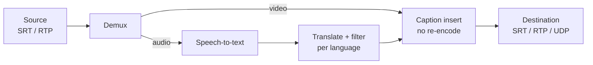

# Overview

> **Summary:** MULTI is a self-hosted, open-source inline box: live SRT/RTP in, local AI captions in several languages embedded without re-encoding, stream out. Lead selling point: $0 per captioned hour versus cloud or human captioning.

MULTI is a self-hosted, open-source service that takes a live video stream in, generates closed captions from its audio in several languages at once, embeds them into the stream, and sends it back out, adding as little delay as possible.

**Problem.** Live captioning today means paying per hour for human stenographers or cloud APIs, sending audio off-site, and wiring several tools together. Small broadcasters, churches, schools, event streamers and municipal channels often go without captions, or with English only.

**Solution.** One binary that sits inline between a source (encoder, camera, playout) and a destination (CDN, decoder, restreamer). It ingests SRT or RTP, runs a small speech model on a local GPU or CPU, translates the text, filters it, and inserts standard caption tracks (CEA-608/708 and others) without re-encoding the video.

**Why local wins.** Once the hardware is paid for, MULTI costs nothing per hour of captioning. Cloud captioning bills every minute, per language, forever. That cost difference is the lead message in all positioning.

|  | MULTI (local) | Cloud captioning API | Human live captioner |
| --- | --- | --- | --- |
| Cost per extra hour | $0 (electricity only) | Billed per minute, per language | Billed per hour, usually one language |
| Extra languages | Free, limited by GPU | Each billed separately | A captioner per language |
| Audio leaves the building | Never | Always | Usually (remote captioner) |
| Works if internet drops | Yes (local outputs) | No | No, if remote |
| Latency control | Engineer tunes it | Fixed by vendor | Fixed by the person |
| Accuracy on names and jargon | Good with custom vocabulary | Good | Best |

Launch material should include a cost calculator: hours streamed per week × languages × a typical cloud rate, compared with a one-time GPU and a MULTI subscription.

Video takes the short path straight through; audio branches off to speech recognition, and the resulting caption text rejoins the video at insertion.

