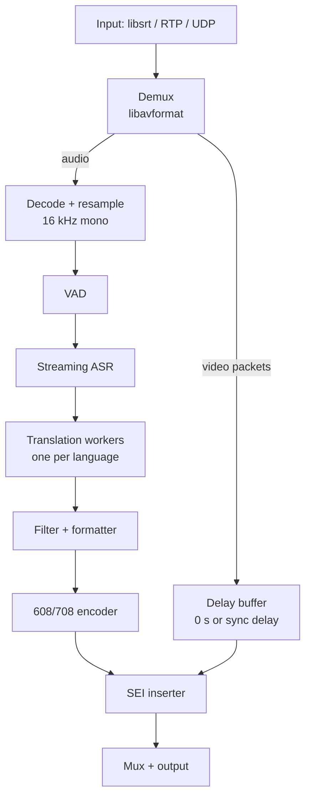

# Proposed architecture and technology

> **Summary:** Rust single binary linking media libs; captions injected as SEI without decoding video. Candidate components and licences (FFmpeg or GStreamer, libsrt, whisper.cpp, ONNX Runtime, llama.cpp) and the Rust crates to evaluate in M0.

> **Update after M0 (2026-09-25):** the component choices below are settled by ADRs and supersede the candidate tables in this section: pipeline base GStreamer ([ADR-0004](../decisions/ADR-0004-pipeline-base.md)); captions via GStreamer's `tttocea708` + `h26xccinserter` ([ADR-0003](../decisions/ADR-0003-caption-insertion.md)); ASR Nemotron 3.5 Streaming via sherpa-onnx ([ADR-0005](../decisions/ADR-0005-asr-backend.md)); translation CTranslate2 + opus-mt ([ADR-0006](../decisions/ADR-0006-translation-backend.md)).

Decision: MULTI is written in **Rust**, as a single native binary that links the media libraries directly and runs speech and translation models in-process, rather than piping the ffmpeg CLI to a Python script. Rust matches the reliability-first principle: memory safety and compile-time data-race checks for a 24/7 network service, predictable latency with no garbage collector, and one toolchain for Linux, Windows, x86-64 and ARM64.

**Why not "ffmpeg CLI + Python":** stock FFmpeg can pass captions through but cannot generate CEA-608/708 from text, so we need to touch the video packets ourselves anyway. Owning the pipeline also gives us control over timestamps, lower latency and one clean binary to sell.

The video path never decodes frames; captions are written into the existing H.264/HEVC bitstream as SEI messages keyed to presentation timestamps.

**Candidate components (licences from memory — verify each before committing)**

| Layer | Candidate | Licence | Notes |
| --- | --- | --- | --- |
| Demux/mux, protocols | FFmpeg libav* (LGPL build) | LGPL-2.1 | Avoid GPL-only and `--enable-nonfree` parts so binaries stay redistributable |
| Alternative pipeline | GStreamer + gst-plugins-rs caption elements | LGPL / MPL | Has text-to-608/708 and caption combiner elements; worth a spike against FFmpeg |
| SRT | libsrt | MPL-2.0 | Standard SRT implementation |
| 608/708 encoding | libcaption | MIT | Encodes captions into H.264 SEI; may need HEVC work |
| Speech-to-text runtime | whisper.cpp or CTranslate2 (faster-whisper) | MIT | whisper.cpp suits C++/ARM/Windows; CTranslate2 is very fast on CUDA |
| Speech model | Whisper small / large-v3-turbo, distil-whisper | MIT | Whisper is not natively streaming; needs a chunked/LocalAgreement strategy |
| Alternative ASR | NVIDIA Parakeet / Canary, Moonshine | Varies | True streaming options; check licence and language coverage |
| VAD | Silero VAD | MIT | Small, CPU-friendly |
| Translation | Small LLM (e.g. Qwen, Gemma class) via llama.cpp, or opus-mt / M2M-100 | Varies | Avoid NLLB-200 and SeamlessM4T: non-commercial licences |
| Web UI / API | Embedded HTTP server + static UI | — | Ships inside the binary |

**Rust building blocks (to confirm in M0)**

| Need | Crate(s) | Wraps |
| --- | --- | --- |
| Async runtime, networking | tokio | — |
| Media pipeline | ffmpeg-next or rsmpeg; or gstreamer-rs | FFmpeg / GStreamer (gst-plugins-rs caption elements are already Rust) |
| SRT | srt-tokio, or bindings to libsrt | libsrt |
| Speech-to-text | whisper-rs; ort | whisper.cpp; ONNX Runtime |
| Translation | llama-cpp-2; ct2rs | llama.cpp; CTranslate2 |
| Web UI, REST API | axum, plus UI assets embedded with rust-embed | — |
| Metrics | prometheus or metrics-exporter-prometheus | — |
| Config | serde + toml / serde_yaml, clap for CLI | — |

The hard part of the Rust build is the C/C++ dependencies (FFmpeg, whisper.cpp, CUDA), not the Rust itself. CI must build these for every target; cross-compiling for ARM64 and Windows is a risk to prove out early.

**Model choice strategy.** Ship a model registry, not a hard-coded model: the operator picks speed vs accuracy per stream, and models download on first run (so their licences travel with them, not with our binary).

